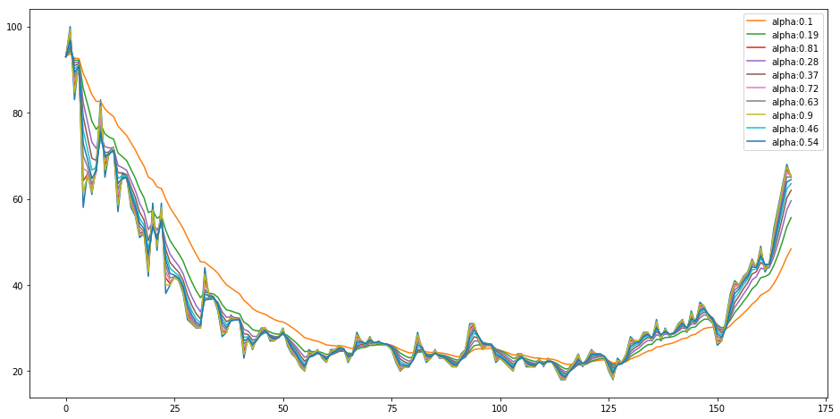
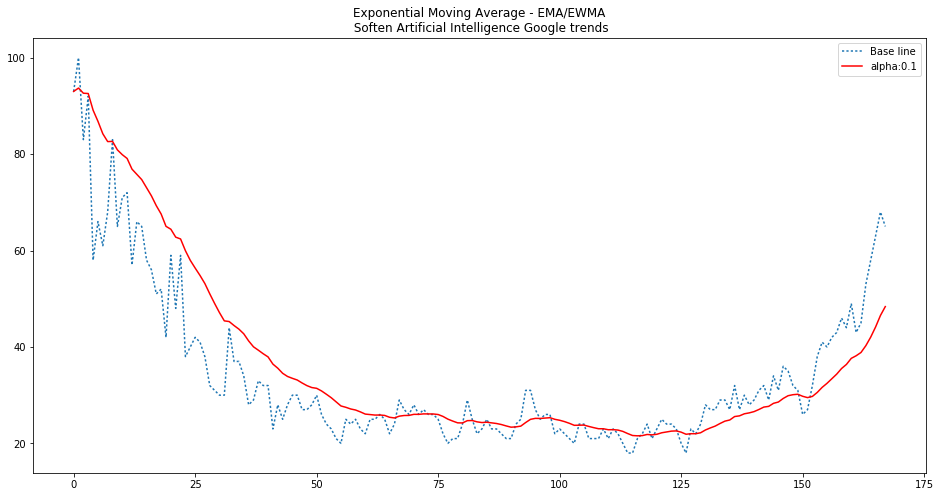
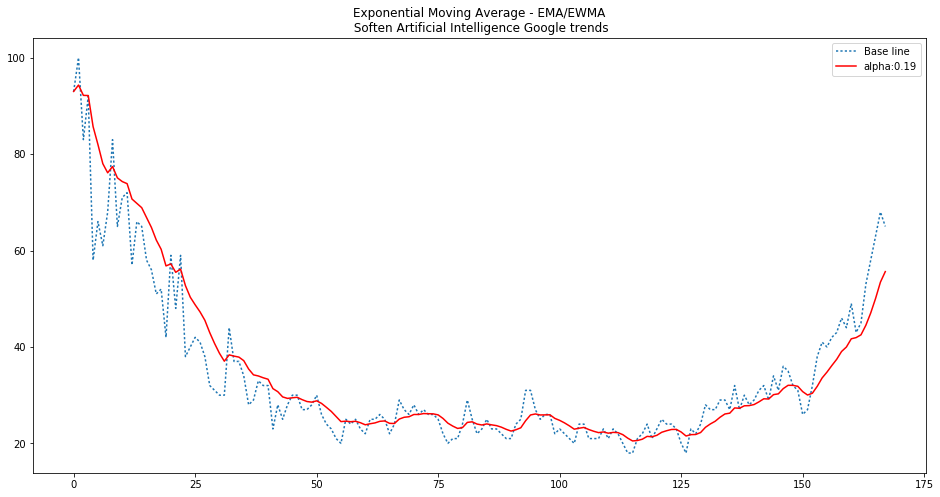
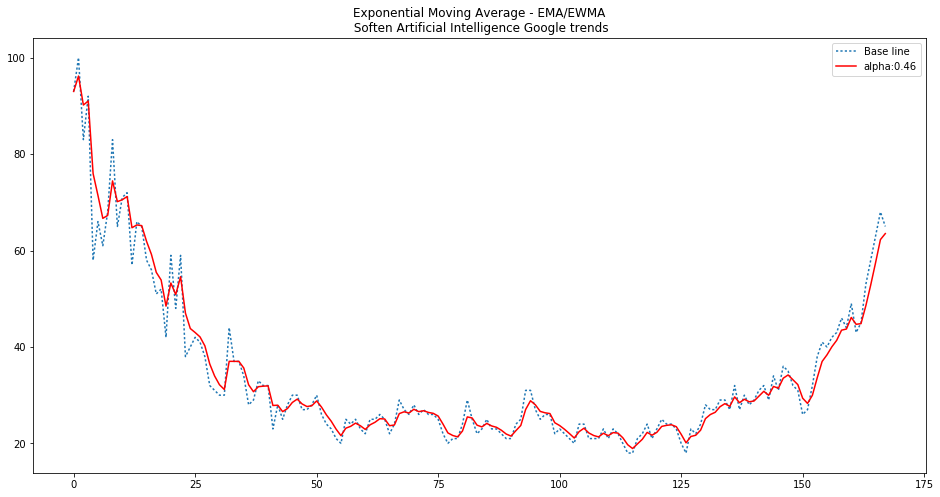
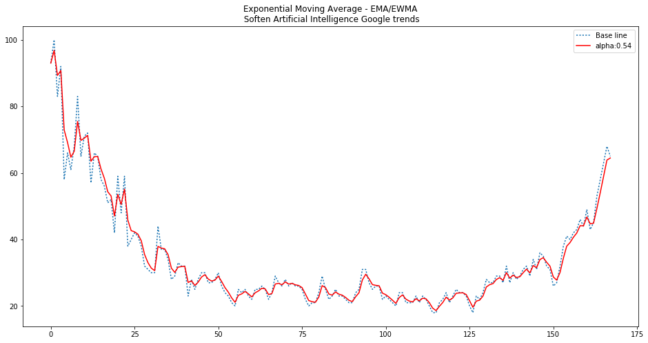
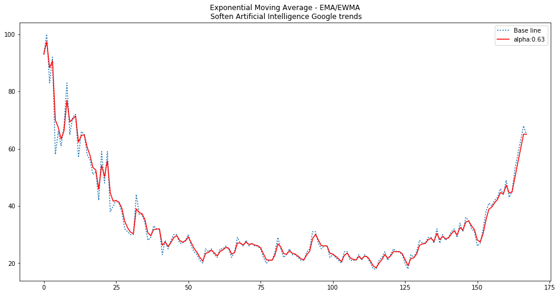
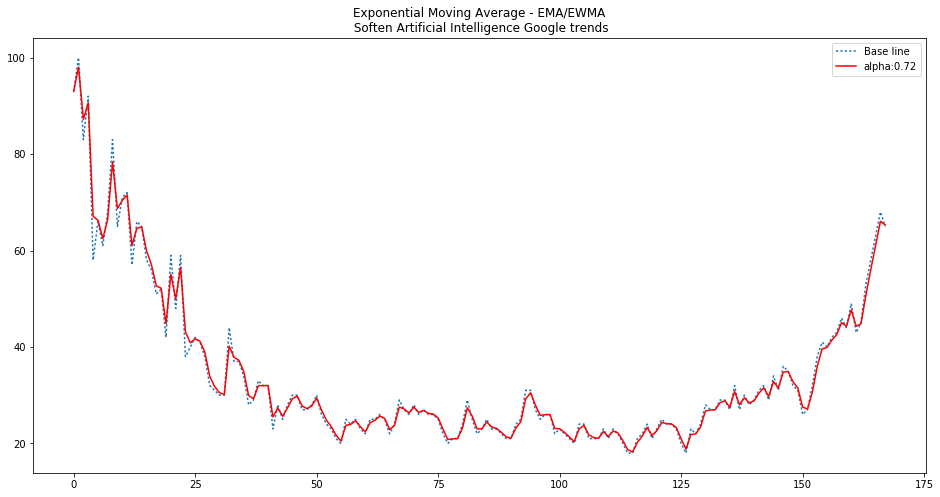

# Exponential Moving Average demonstration

The purpose of this notebook is to show how EMA softens a time series.


```python
import numpy as np
import pandas as pd
import matplotlib.pyplot as plt
```


```python
#artificial intelligence trend from google trends:
#Source: https://trends.google.com/trends/explore?date=all&q=artificial%20intelligence
csvf ="ai.csv"

#Skip first 2 rows that contain a text description and an empty line
ait = pd.read_csv(csvf,skiprows=2)

```


```python
#Visualize the content
ait.head(10)
```


<div>
<table border="1" class="dataframe">
  <thead>
    <tr style="text-align: right;">
      <th></th>
      <th>Mes</th>
      <th>artificial intelligence: (Todo el mundo)</th>
    </tr>
  </thead>
  <tbody>
    <tr>
      <th>0</th>
      <td>2004-01</td>
      <td>93</td>
    </tr>
    <tr>
      <th>1</th>
      <td>2004-02</td>
      <td>100</td>
    </tr>
    <tr>
      <th>2</th>
      <td>2004-03</td>
      <td>83</td>
    </tr>
    <tr>
      <th>3</th>
      <td>2004-04</td>
      <td>92</td>
    </tr>
    <tr>
      <th>4</th>
      <td>2004-05</td>
      <td>58</td>
    </tr>
    <tr>
      <th>5</th>
      <td>2004-06</td>
      <td>66</td>
    </tr>
    <tr>
      <th>6</th>
      <td>2004-07</td>
      <td>61</td>
    </tr>
    <tr>
      <th>7</th>
      <td>2004-08</td>
      <td>68</td>
    </tr>
    <tr>
      <th>8</th>
      <td>2004-09</td>
      <td>83</td>
    </tr>
    <tr>
      <th>9</th>
      <td>2004-10</td>
      <td>65</td>
    </tr>
  </tbody>
</table>
</div>


```python
#Verify that the index is sorted
ait = ait.sort_values('Mes')
ait.head(10)
```


<div>
<table border="1" class="dataframe">
  <thead>
    <tr style="text-align: right;">
      <th></th>
      <th>Mes</th>
      <th>artificial intelligence: (Todo el mundo)</th>
    </tr>
  </thead>
  <tbody>
    <tr>
      <th>0</th>
      <td>2004-01</td>
      <td>93</td>
    </tr>
    <tr>
      <th>1</th>
      <td>2004-02</td>
      <td>100</td>
    </tr>
    <tr>
      <th>2</th>
      <td>2004-03</td>
      <td>83</td>
    </tr>
    <tr>
      <th>3</th>
      <td>2004-04</td>
      <td>92</td>
    </tr>
    <tr>
      <th>4</th>
      <td>2004-05</td>
      <td>58</td>
    </tr>
    <tr>
      <th>5</th>
      <td>2004-06</td>
      <td>66</td>
    </tr>
    <tr>
      <th>6</th>
      <td>2004-07</td>
      <td>61</td>
    </tr>
    <tr>
      <th>7</th>
      <td>2004-08</td>
      <td>68</td>
    </tr>
    <tr>
      <th>8</th>
      <td>2004-09</td>
      <td>83</td>
    </tr>
    <tr>
      <th>9</th>
      <td>2004-10</td>
      <td>65</td>
    </tr>
  </tbody>
</table>
</div>


```python
aitv = ait.iloc[:,1].values
aitv
```


    array([ 93, 100,  83,  92,  58,  66,  61,  68,  83,  65,  71,  72,  57,
            66,  65,  58,  56,  51,  52,  42,  59,  48,  59,  38,  40,  42,
            41,  38,  32,  31,  30,  30,  44,  37,  37,  34,  28,  29,  33,
            32,  32,  23,  28,  25,  28,  30,  30,  27,  27,  28,  30,  26,
            24,  23,  21,  20,  25,  24,  25,  23,  22,  25,  25,  26,  25,
            22,  24,  29,  27,  26,  28,  26,  27,  26,  26,  25,  22,  20,
            21,  21,  24,  29,  25,  22,  23,  25,  23,  23,  22,  21,  21,
            24,  25,  31,  31,  27,  25,  26,  26,  22,  23,  22,  21,  20,
            24,  24,  21,  21,  21,  23,  21,  23,  22,  20,  18,  18,  21,
            22,  24,  21,  23,  25,  24,  24,  23,  20,  18,  23,  22,  24,
            28,  27,  27,  29,  29,  27,  32,  27,  30,  28,  29,  31,  32,
            29,  34,  31,  36,  35,  32,  31,  26,  27,  32,  38,  41,  40,
            42,  43,  46,  44,  49,  43,  45,  53,  58,  63,  68,  65])


```python
#Create an array from 0 to the number of elements of the trend 
t = np.arange(0,aitv.shape[0])
#modify the width and height of the plot
fig=plt.figure(figsize=(16,4))

plt.plot(t,aitv)
plt.show()
```


# Exponential Moving average (EMA)

Ema formula:  
t=0 -> S=Y  
t>0 -> S = alpha*St + (1-alpha)*St-1  


```python
#Define EMA
def EMA(v_prev,v_now,alpha):
    return alpha*v_now+(1-alpha)*v_prev

#Create values for alpha
_alpha = np.linspace(0.1,0.9,10)
print("Alpha values:\n",_alpha)

#Get the EMA for different alphas and save the values in a dictionary
ema_dic = {}
for _a in _alpha:
    ema_dic[_a]=[aitv[0]]
    for _ in range(0,aitv.shape[0]-1):
        _ema = EMA(ema_dic[_a][_],aitv[_+1],_a)
        ema_dic[_a].append(_ema)
```

    Alpha values:
     [ 0.1         0.18888889  0.27777778  0.36666667  0.45555556  0.54444444
      0.63333333  0.72222222  0.81111111  0.9       ]


```python
print("See if the generated values have the same number of elements",len(ema_dic[0.1]),aitv.shape)

```

    See if the generated values have the same number of elements 168 (168,)


#  Visualize EMA


```python
t = np.arange(0,aitv.shape[0])
fig=plt.figure(figsize=(16,8))

#Plot the base line points
plt.plot(t,aitv)

for key in ema_dic.keys():
    plt.plot(t,ema_dic[key],label="alpha:"+str(np.round(key,2)))
plt.legend()
plt.show()
```





## Separate plots for a better visualization


```python
t = np.arange(0,aitv.shape[0])

for key in sorted(ema_dic.keys()):
    fig=plt.figure(figsize=(16,8))
    plt.plot(t,aitv,label="Base line",linestyle=':')
    plt.plot(t,ema_dic[key],label="alpha:"+str(np.round(key,2)),c="red")
    plt.title("Exponential Moving Average - EMA/EWMA\n Soften Artificial Intelligence search in Google trends")
    plt.legend()
    plt.show()
```




















EMA will soften more the closer alpha gets to zero. The closer to zero, more importance will be given to previous data.


```python

```
